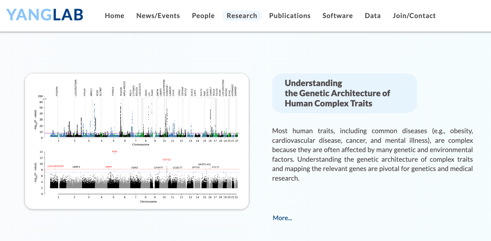

Cite `MeDuSA`
-------------------
(Not published) MeDuSA: mixed model-based deconvolution of cell-state abundances along a one-dimensional trajectory. 
Liyang Song, Xiwei Sun, Ting Qi, Jian Yang

Contact
-------------------
If you have any questions about MeDuSA, please feel free to leave messages on the github [issues](https://github.com/LeonSong1995/MeDuSA/issues) or contact me: songliyang@westlake.edu.cn.

Our group
-------------------
[YangLab](https://yanglab.westlake.edu.cn/)

Parameters of `MeDuSA`
-------------------
- `bulk`: A matrix of bulk RNA-seq data. Each row corresponds to a specific gene, and each column corresponds to a particular sample.
- `sce`: A `Seurat` object of the reference scRNA-seq data. Meta-data of the seurat object (sce@meta.data) needs to include two columns named as cell_type and cell_trajectory.
- `select.ct`: A character variable of the target cell type.
- `ncpu`: The number of CPU cores to be used.
- `smooth`: A Boolean variable to determine whether to smooth the estimated cell-state abundance or not. The default value is TRUE.
- `smoothMethod`: A character variable to determine the smoothing method. The default method is loess.
- `nbins`: A numeric variable to determine the number of bins along the cell trajectory, which is used to ensure the selected genes are uniformly scattered along the given trajectory. The default value is 10.
- `resolution`: A numeric variable to determine the number of cell bins along the cell trajectory (i.e., the resolution of the deconvolution analysis). The default value is 50.
- `knots`: A numeric variable to specify the number of knots. The default value is 10.
- `start`: A numeric vector for the initial value of the restricted maximum likelihood (REML). The default value is c(1e-5,1e-2).
- `family`: A character variable to specify the distribution of GAM.
- `maxiter`: The iteration number of REML. The default value is 1e+4.
- `adj`: A Boolean variable to determine whether to include covariates when estimating the cell-state abundance.
- `CAR`: A Boolean variable to determine whether to model abundance correlations among cells.
- `phi`: A numeric vector for searching the optimal cell correlations.
- `fixCov`: A matrix (vector) of fixed covariates in the model (i.e., covariates for estimating cell-state abundance). The default value is NULL.
- `markerGene`: A character vector of marker genes over the cell-state trajectory. The default value is NULL. With the default, MeDuSA selects genes using the GAM-Wald or Wilcoxon rank-sum test.
- `method`: A character variable to specify the method used in selecting marker genes (wilcox or gam). The default value is wilcox.
- `geneNumber`: A numeric variable to determine the number of signature genes. The default value is 200.
- `span`: A numeric variable to control the degree of smoothing for loess.
- `neighbor`: A numeric variable to determine the number of neighboring cells used in smoothing (do not use when the smooth method is loess).
- `fractional`: A Boolean variable to determine whether to normalize the estimated cell-state abundance to the fractional abundance (0,1).
